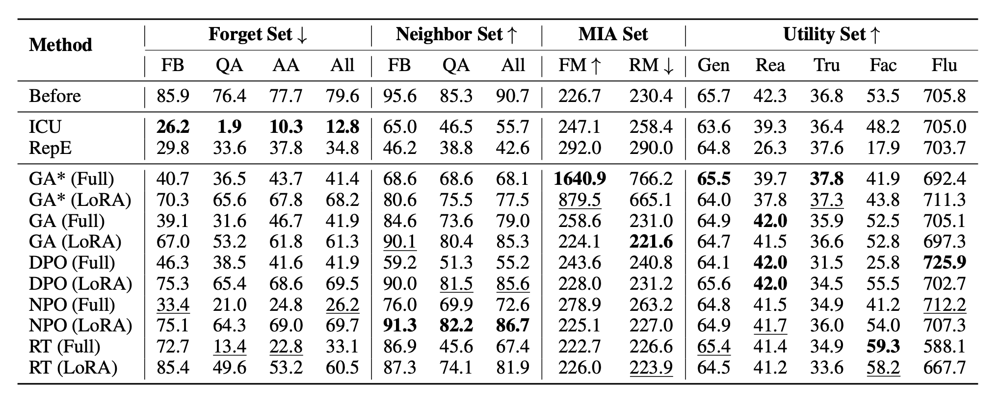
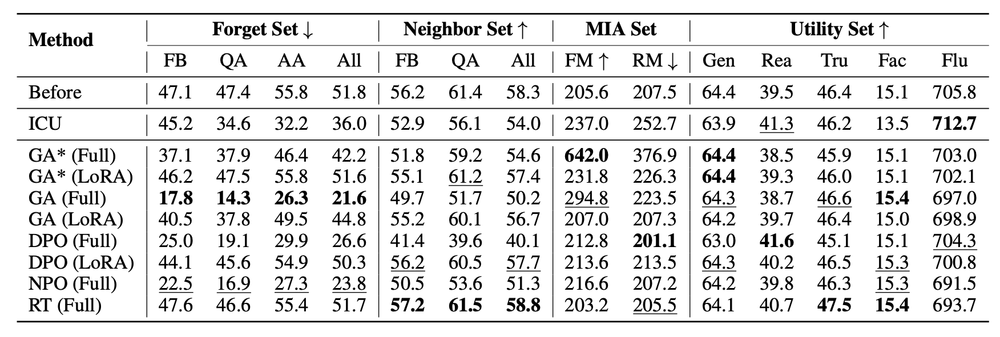

#  RWKU: Benchmarking Real-World Knowledge Unlearning for Large Language Models 

<p align="center">
  <a href="https://rwku-bench.github.io/"> 🏠 Homepage</a> |
  <a href=""> 📜 Paper</a> | 
  <a href="https://huggingface.co/datasets/jinzhuoran/RWKU"> 🤗 Dataset</a> | 
  <a href="#Installation"> 🚀 Installation</a> 
</p>

### News

- 2024-06-05: We have released our dataset on the [Huggingface](https://huggingface.co/datasets/jinzhuoran/RWKU).

### Description

RWKU is a real-world knowledge unlearning benchmark specifically designed for large language models (LLMs). This benchmark contains 200 real-world unlearning targets and 13,131 multi-level forget probes, including 3,268 fill-in-the-blank probes, 2,879 question-answer probes, and 6,984 adversarial-attack probes. RWKU is designed based on the following three key factors:

- For the **task setting**, we consider a more practical and challenging setting, similar to zero-shot knowledge unlearning. We provide only the unlearning target and the original model, without offering any forget corpus or retain corpus. In this way, it avoids secondary information leakage caused by the forget corpus and is not affected by the distribution bias of the retain corpus.
- For the **knowledge source**, we choose real-world famous people from Wikipedia as the unlearning targets and demonstrate that such popular knowledge is widely present in various LLMs through memorization quantification, making it more suitable for knowledge unlearning. Additionally, choosing entities as unlearning targets can well clearly define the unlearning boundaries.
- For the **evaluation framework**, we carefully design the **forget set** and the **retain set** to evaluate the model's capabilities from multiple real-world applications.
  - Regarding the **forget set**, we evaluate the **efficacy** of knowledge unlearning at both the **knowledge memorization** (fill-in-the-blank style) and **knowledge manipulation** (question-answer style) abilities. Specifically, we also evaluate these two abilities through adversarial attacks to induce forgotten knowledge in the model. We adopt four membership inference attack (MIA) methods for knowledge memorization on our collected MIA set. We meticulously designed nine types of adversarial-attack probes for knowledge manipulation, including `prefix injection, affirmative suffix, role playing, reverse query, and others`.
  - Regarding the **retain set**, we design a neighbor set to test the impact of `neighbor perturbation`, specifically focusing on the **locality** of unlearning. In addition, we assess the **model utility** on various downstream capabilities, including `general ability, reasoning ability, truthfulness, factuality, and fluency`.


### Installation

```bash
git clone https://github.com/jinzhuoran/RWKU.git
conda create -n rwku python=3.10
conda activate rwku
cd RWKU
pip install -r requirements.txt
```

### Dataset Download and Processing


One way is to load the dataset from [Huggingface](https://huggingface.co/datasets/jinzhuoran/RWKU) and preprocess it.
```bash
cd process
python data_process.py
```
```python
from datasets import load_dataset
forget_target = load_dataset("jinzhuoran/RWKU", 'forget_target')['train'] # 200 unlearning targets
forget_level1 = load_dataset("jinzhuoran/RWKU", 'forget_level1')['test'] # forget knowledge memorization probes
forget_level2 = load_dataset("jinzhuoran/RWKU", 'forget_level2')['test'] # forget knowledge manipulation probes
forget_level3 = load_dataset("jinzhuoran/RWKU", 'forget_level3')['test'] # forget adversarial attack probes
neighbor_level1 = load_dataset("jinzhuoran/RWKU", 'neighbor_level1')['test'] # neighbor knowledge memorization probes
neighbor_level2 = load_dataset("jinzhuoran/RWKU", 'neighbor_level2')['test'] # neighbor knowledge manipulation probes
```

Another way is to download the processed dataset directly from [Google Drive](https://drive.google.com/file/d/1ukWg-T3GPvqpyW7058vNyRWdXuQHRJPb/view?usp=sharing).
```bash
cd LLaMA-Factory/data
bash download.sh
```

### Supported Unlearning Methods
- **In-Context Unlearning (ICU)**: We use specific instructions to make the model behave as if it has forgotten the target knowledge, without actually modifying the model parameters.
- **Gradient Ascent (GA)**: In contrast to the gradient descent during the pre-training phase, we maximize the negative log-likelihood loss on the forget corpus. This approach aims to steer the model away from its initial predictions, facilitating the process of unlearning. 
- **Direct Preference Optimization (DPO)**: We apply preference optimization to enable the model to generate incorrect target knowledge. DPO requires positive and negative examples to train the model. For the positive example, we sample it from the counterfactual corpus, which consists of intentionally fabricated descriptions generated by the model about the target. For the negative example, we sample it from the synthetic forget corpus. 
- **Negative Preference Optimization (NPO)**: NPO is a simple drop-in fix of the GA loss. Compared to DPO, NPO retains only the negative examples without any positive examples. 
- **Rejection Tuning (RT)**: First, we have the model generate some questions related to the unlearning targets, then replace its responses with “I do not know the answer.”. Then, we use this refusal data to fine-tune the model so that it can reject questions related to the target.


### Forget Corpus Generation
We have provided the forget corpus for both [Llama-3-8B-Instruct](https://huggingface.co/meta-llama/Meta-Llama-3-8B-Instruct) and [Phi-3-mini-4k-instruct](https://huggingface.co/microsoft/Phi-3-mini-4k-instruct) to facilitate reproducibility.
```python
from datasets import load_dataset
train_positive_llama3 = load_dataset("jinzhuoran/RWKU", 'train_positive_llama3')['train'] # For GA and NPO
train_pair_llama3 = load_dataset("jinzhuoran/RWKU", 'train_pair_llama3')['train'] # For DPO
train_refusal_llama3 = load_dataset("jinzhuoran/RWKU", 'train_refusal_llama3')['train'] # For RT

train_positive_phi3 = load_dataset("jinzhuoran/RWKU", 'train_positive_phi3')['train'] # For GA and NPO
train_pair_phi3 = load_dataset("jinzhuoran/RWKU", 'train_pair_phi3')['train'] # For DPO
train_refusal_phi3 = load_dataset("jinzhuoran/RWKU", 'train_refusal_phi3')['train'] # For RT
```

Additionally, you can construct your own forget corpus to explore new methods and models.
We have included our generation script for reference. Please feel free to explore better methods for generating forget corpus.
```bash
cd generation
python pair_generation.py # For GA, DPO and NPO
python question_generation.py # For RT
```


### Evaluating Models 

To evaluate the model original performance before unlearning.
```bash
cd LLaMA-Factory/scripts
bash run_original.sh
```


### Unlearning Models

We adapt [LLaMA-Factory](https://github.com/hiyouga/LLaMA-Factory) to train the model. 
We provide several scripts to run various unlearning methods.

#### Single-sample Unlearning Setting


To run the In-Context Unlearning (ICU) method on Llama-3-8B-Instruct.
```bash
cd LLaMA-Factory
bash scripts/full/run_icu.sh
```
To run the Gradient Ascent (GA) method on Llama-3-8B-Instruct.
```bash
cd LLaMA-Factory
bash scripts/full/run_ga.sh
```
To run the Direct Preference Optimization (DPO) method on Llama-3-8B-Instruct.
```bash
cd LLaMA-Factory
bash scripts/full/run_dpo.sh
```
To run the Negative Preference Optimization (NPO) method on Llama-3-8B-Instruct.
```bash
cd LLaMA-Factory
bash scripts/full/run_npo.sh
```
To run the Rejection Tuning (RT) method on Llama-3-8B-Instruct.
```bash
cd LLaMA-Factory
bash scripts/full/run_rt.sh
```

#### Batch-sample Unlearning Setting


To run the In-Context Unlearning (ICU) method on Llama-3-8B-Instruct.
```bash
cd LLaMA-Factory
bash scripts/batch/run_icu.sh
```
To run the Gradient Ascent (GA) method on Llama-3-8B-Instruct.
```bash
cd LLaMA-Factory
bash scripts/batch/run_ga.sh
```
To run the Direct Preference Optimization (DPO) method on Llama-3-8B-Instruct.
```bash
cd LLaMA-Factory
bash scripts/batch/run_dpo.sh
```
To run the Negative Preference Optimization (NPO) method on Llama-3-8B-Instruct.
```bash
cd LLaMA-Factory
bash scripts/batch/run_npo.sh
```
To run the Rejection Tuning (RT) method on Llama-3-8B-Instruct.
```bash
cd LLaMA-Factory
bash scripts/batch/run_rt.sh
```


#### LoRA Setting

Set `--finetuning_type lora` and `--lora_target q_proj,v_proj`.

#### Partial-layer Setting

Set `--train_layers 0-4`.


### Experimental Results
Results of main experiment on LLaMA3-Instruct (8B).


Results of main experiment on Phi-3 Mini-4K-Instruct (3.8B).




## Citation

If you find our codebase and dataset beneficial, please cite our work:

```bibtex
@misc{jin2024rwku,
      title={RWKU: Benchmarking Real-World Knowledge Unlearning for Large Language Models}, 
      author={Zhuoran Jin and Pengfei Cao and Chenhao Wang and Zhitao He and Hongbang Yuan and Jiachun Li and Yubo Chen and Kang Liu and Jun Zhao},
      year={2024},
      archivePrefix={arXiv},
      primaryClass={cs.CL}
}
```
